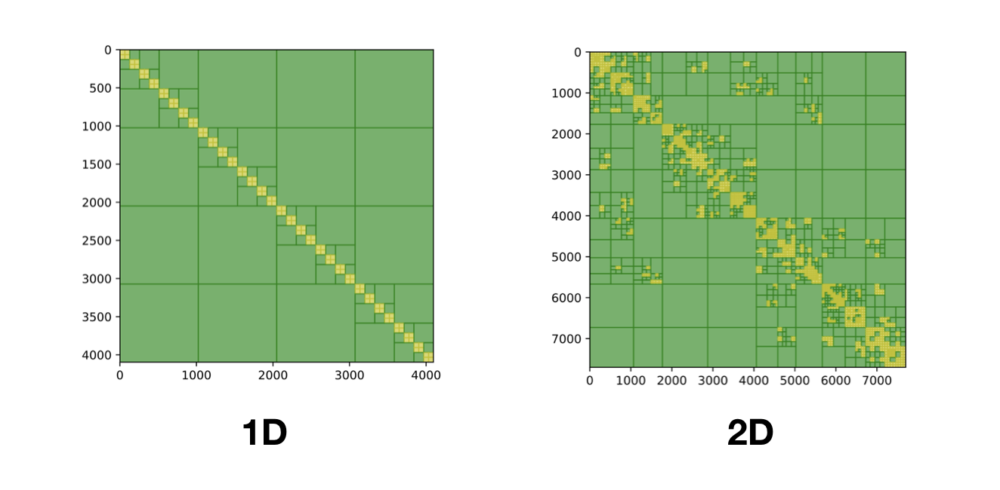

# Hmatrix.jl

Hmatrix.jl is a hierarchical matrix library in Julia. Current implementations include construction, matrix vector multiplication, LU factorization and solve. It is written to achieve linear complexity for both storage and computation.



### Installing

```
]add https://github.com/kailaix/Hmatrix.jl
]build Hmatrix
```

### Testing

```
]test Hmatrix
```

### Getting Started

```julia
Hparams.verbose = true
X = LinRange(0,10,2000)|>collect
Hparams.Geom = X  # create a geometric cluster 
Hparams.Kernel = (x,y)->1/(1+(x-y)^2) # define the kernel
Hparams.MaxBlock = 500 # maximum number of leaves in a block
Hparams.MinBlock = 64 # minimum number of leaves in a block
Hparams.MaxRank = 5 # maximum rank for compression
c, H = NewHmat() # create a new H matrix
A = FullMat(Hparams.Kernel, c.X, c.X) # computing the full matrix
```

`H` can be used just like a normal matrix

```julia
y = rand(2000)
H*y
H\y
lu(H)
```


## Authors

* **Kailai Xu** - [Kailai Xu](http://stanford.edu/~kailaix/)


## Research Work

```
Xu, Kailai, and Eric Darve. "Efficient Numerical Method for Models Driven by L\'evy Process via Hierarchical Matrices." arXiv preprint arXiv:1812.08324 (2018).
```

## License

This project is licensed under the MIT License - see the [LICENSE.md](LICENSE.md) file for details
